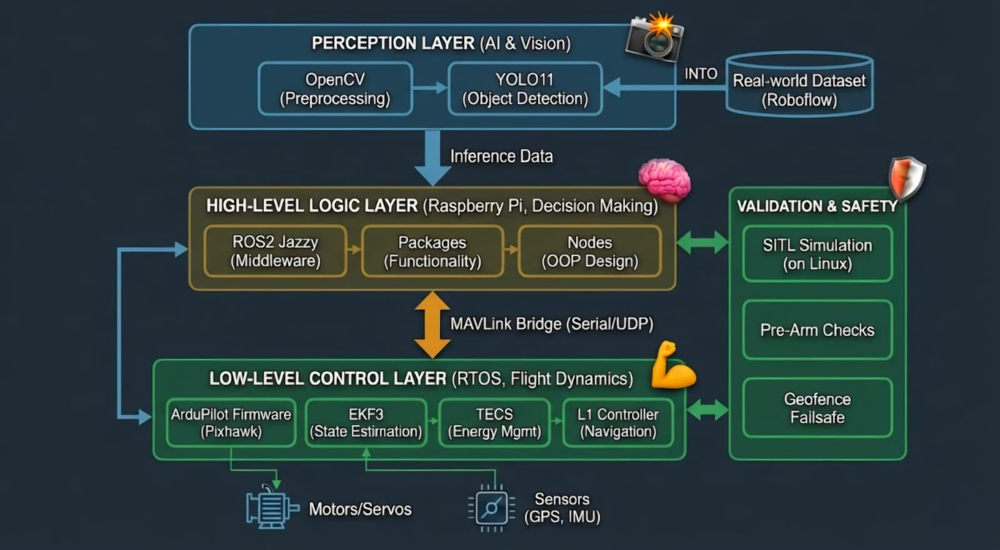
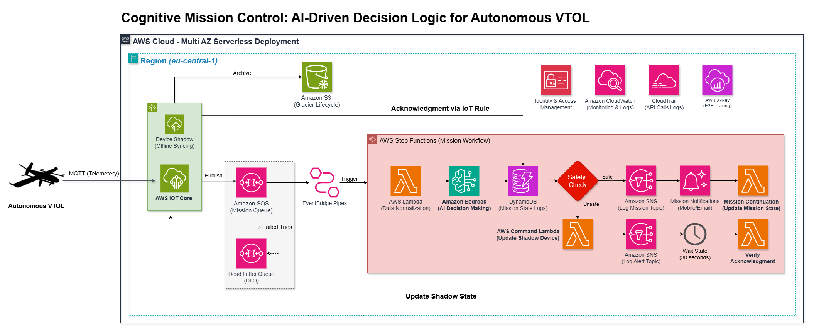

## 🎯 Project Overview
A full-stack autonomous VTOL *(Vertical Take-Off and Landing)* aircraft system combining **onboard embedded flight control** with a **stateless, event-driven AWS cloud extension** for AI-driven mission decision making. Designed to scale from one drone to a **fleet of thousands** with **ZERO architectural changes**. The system lives in two separate parts:
  
<div align="center">
  
| | ✈️ Onboard System | 🌥️ Cloud Extension |
|---|:---:|:---:|
| 🔧 **What** | Embedded flight control & perception | Serverless AWS mission intelligence |
| 🖥️ **Runs on** | Raspberry Pi + Pixhawk | AWS (eu-central-1) |
| ⚡ **Handles** | Anything time-critical | Anything cognitive |
| 🛠️ **Key tech** | ROS2, ArduPilot, YOLO11 | Bedrock, Step Functions, IoT Core |

</div>

> The two parts are **independent by design**. Enabling **horizontal scaling** with **no code modifications**.
> - Onboard system handles everything **time-critical**.
> - Cloud handles everything **cognitive**. <br>


<div align="center">

# ✈️ Part 1: Autonomous VTOL System 

</div>

<div align="center">
  
</div>

## 🧱 System Architecture

The onboard system is structured into three functional layers plus a dedicated validation layer, each with a clear and isolated responsibility boundary:
### 1️⃣ Perception Layer (AI & Vision)
- **Roboflow** → Real-world annotated dataset for model training
- **YOLO11** → Real-time object detection and classification
- **OpenCV** → Frame capture and preprocessing pipeline

### 2️⃣ High-Level Logic Layer (Decision Making on Raspberry Pi)
- **Raspberry Pi** → Onboard compute for decision making
- **ROS2 Jazzy** → Middleware for inter-process communication
- **Custom Packages & Nodes** → OOP-designed mission logic modules
- **MAVLink Bridge (Serial/UDP)** → Bidirectional communication with Pixhawk

### 3️⃣ Low-Level Control Layer (Flight Dynamics on Pixhawk RTOS)
- **ArduPilot Firmware (Pixhawk)** → Flight controller running on RTOS
- **EKF3** → Extended Kalman Filter for state estimation (position, velocity, attitude)
- **TECS** → Total Energy Control System for speed and altitude management
- **L1 Controller** → Lateral navigation and path following

### 4️⃣ Validation & Safety (Pre-flight & In-flight Guardrails)
- **SITL Simulation (Linux)** → Software-in-the-loop testing before hardware deployment 
- **Pre-Arm Checks** → Validates sensor health and system readiness before flight 
- **Geofence Failsafe** → Enforces geographic boundaries and triggers RTL on breach 

<div align="center">

# 🌥️ Part 2: Cloud Extension Architecture

<div align="center">
  
</div>

</div>

## 🎯 Why a Cloud Extension?

The Raspberry Pi was originally responsible for mission logic, state management, data logging, AND running ROS2 + YOLO11 simultaneously - a heavy compute burden for in-flight hardware.

- **The Pi now only handles:** ROS2 coordination + real-time inference
- **The cloud now handles:** Everything cognitive and non-time-critical responsibilities

<div align="center">

| Responsibility | Before (Pi Only) | After (Cloud Extension) |
|---|:---:|:---:|
| 🧠 Mission decision making | Python scripts on Pi | **AWS Bedrock (AI)** |
| 📋 State & mission logging | Local files / SQLite | **DynamoDB** |
| 🔔 Pilot notifications | Ground Control Station only | **SNS (Mobile/Email)** |
| 🔄 Mission state management | In-memory / local | **Device Shadow (with offline sync)** |
| 📨 Message reliability | None | **SQS + Dead Letter Queue** |

</div>

Beyond a single aircraft, the architecture scales horizontally with **ZERO CHANGES** - every service is built to handle a fleet out of the box:

<div align="center">

| Service | Why It Scales |
|---|:---:|
| 🧠 Bedrock Decision Engine | Processes any number of concurrent mission decisions |
| ⚙️ Step Functions Workflow | Each VTOL runs its own independent execution |
| 📡 IoT Core Pipeline | Built for millions of connected devices |
| 🪞 Device Shadow | One isolated shadow per aircraft |

</div>

> ⚠️ **Nothing safety-critical moves to the cloud.** All flight controls, perception & failsafes remain fully onboard.

## 🧱 AWS Cloud Architecture

### Core Pipeline
- **AWS IoT Core** → MQTT ingestion point, Device Shadow for offline sync
- **Amazon SQS** → Mission message queue with Dead Letter Queue after 3 failed retries
- **EventBridge Pipes** → Serverless trigger from SQS to Step Functions
- **AWS Step Functions** → Orchestrates the full mission workflow state machine

### AI & Data
- **Amazon Bedrock** → LLM-powered mission decision making (Safe / Unsafe classification)
- **AWS Lambda** → Data normalization, command dispatch, mission continuation
- **Amazon DynamoDB** → Mission state logs and event history

### Alerting & Feedback
- **Amazon SNS** → Dual-topic alerting: Mission Log Topic (safe) and Alert Topic (unsafe)
- **Device Shadow** → Bidirectional state sync between cloud and VTOL (offline-resilient)

### Observability
- **Amazon CloudWatch** → Monitoring and logs
- **AWS CloudTrail** → API call audit logs
- **AWS X-Ray** → End-to-end distributed tracing
- **IAM** → Least-privilege access control across all services

## 💰 Cost & Scalability Analysis

This entire cloud architecture is designed with a **"Pay-as-you-go" serverless model**. By utilizing event-driven triggers, no infrastructure runs 24/7 and no idle containers. When the fleet is grounded, 
the cost is **$0.00**. 

### 📉 Estimated Cost per Flight
The total cost for a single mission execution (**C<sub>total</sub>**) is the sum of its serverless components:

**C<sub>total</sub>** = **C<sub>IoT</sub>** + **C<sub>Lambda</sub>** + **C<sub>Bedrock</sub>** + **C<sub>StepFunctions</sub>** + **C<sub>SNS</sub>** + **C<sub>DB</sub>**

<div align="center">

| Service | Estimated Usage (1 Mission) | Estimated Cost (USD) |
|:---:|:---:|:---:|
| 📡 AWS IoT Core | 100 MQTT Messages + 2 Shadow Updates | ~$0.00012 |
| 🧠 Amazon Bedrock | 300 Input + 100 Output Tokens (Nova Lite) | ~$0.000042 |
| ⚙️ Step Functions | 12 State Transitions | ~$0.00030 |
| ⚡ AWS Lambda | 4 Invocations (128MB, avg. 200ms) | ~$0.000016 |
| 📨 SQS + SNS | < 1,000 requests | < $0.00001 |
| **💰 Total** | **1 Complete Mission Cycle** | **~$0.00049** |

</div>

> 💡 **Conclusion:** Can run **2,000+ missions for $1.00 USD**, making this one of the most cost-efficient autonomous fleet architectures possible.

### 🚀 Scaling to a Fleet (1,000+ VTOLs)
Unlike monolithic designs, this architecture scales horizontally with **zero code changes**:

- **🧵 Concurrency** → Lambda & Step Functions handle thousands of concurrent 
  mission executions out of the box
- **🛡️ Throttling Protection** → SQS acts as a buffer, ensuring the Cloud Extension is never overwhelmed by sudden telemetry spikes from the fleet.
- **🌍 Regional Availability** → Stack is deployed via **AWS CDK**, allowing one-click replication across multiple AWS Regions (e.g., `us-east-1`, `eu-central-1`) to reduce latency for global operations.

### 🛠️ Cost Optimization Strategies

To maintain this efficiency, the following optimizations are implemented:

1. 🧠 **Model Selection:** Using **Amazon Nova Lite** over Claude 3.5 Sonnet reduces inference cost by ~90% while maintaining sufficient reasoning for safety classification
2. 📡 **Basic Ingest:** Telemetry that doesn't require the Message Broker is routed via **Basic Ingest** to eliminate 100% of the IoT Core messaging fee
3. 🗑️ **Log Retention:** CloudWatch logs configured with a **7-day expiration** to prevent storage costs from accumulating over time

## 🔄 Mission Workflow Detail

**✅ Safe Path:**
```
Safety Check → SAFE
→ SNS (Log Mission Topic)
→ Mission Notifications (Pilot Mobile/Email)
→ Mission Continuation Lambda (DynamoDB update + Shadow sync)
→ END
```

**❌ Unsafe Path:**
```
Safety Check → UNSAFE
→ AWS Command Lambda (Update Device Shadow → VTOL receives abort command)
→ SNS (Log Alert Topic)
→ Wait State (30 seconds, waitForTaskToken)
→ ACK received via IoT Rule → Verify Acknowledgment Lambda
→ END
```

> The Wait State uses Step Functions' `.waitForTaskToken` callback pattern. The task token is embedded in the command sent to the VTOL. The VTOL acknowledges via MQTT → IoT Rule → `SendTaskSuccess` to resume execution.

## 🌉 Integration: How Onboard Meets Cloud

The bridge between the two systems is a single well-defined interface:

```
ArduPilot (Pixhawk)
    │
    │ MAVLink (Serial/UDP)
    ▼
ROS2 Node (MAVLink Bridge)
    │
    │ MQTT over TLS (Port 8883)
    ▼
AWS IoT Core
    │
    └─► Mission Queue → Step Functions → Bedrock Decision
    └─► Device Shadow ← Command Lambda (mission updates back to VTOL)
```

The ROS2 MAVLink bridge node publishes telemetry to IoT Core and subscribes to Device Shadow delta updates — allowing cloud-originated commands (e.g., abort, reroute) to flow back down to the VTOL seamlessly.

## 🚀 Deployment

### Prerequisites
```bash
Python 3.11+
AWS CLI configured (aws configure)
AWS CDK installed (npm install -g aws-cdk)
```

### Deploy Cloud Stack
```bash
cd cloud/infrastructure
pip install -r requirements.txt
cdk bootstrap
cdk deploy
```

---

# 🗺️ Roadmap

### Onboard System
- [x] YOLO11 model training on Roboflow dataset
- [x] ROS2 workspace setup with MAVLink bridge node
- [x] SITL simulation validation
- [x] Geofence and failsafe parameter tuning
- [ ] Hardware integration on Pixhawk + Raspberry Pi

### Cloud Extension
- [ ] AWS CDK infrastructure stack
- [ ] Lambda functions (normalization, command, continuation)
- [ ] Step Functions state machine definition
- [ ] Bedrock prompt engineering for safety classification
- [ ] IoT Core rules + Device Shadow integration
- [ ] End-to-end integration test (SITL → Cloud → ACK loop)

## 📖 Documentation

<div align="center">

| Document | Description |
|---|---|
| `docs/onboard_architecture.jpeg` | Full onboard system flowchart |
| `docs/cloud_architecture.png` | AWS cloud architecture diagram |
| `docs/integration_guide.md` | How MAVLink telemetry flows into AWS IoT Core |

</div>

## 🤝 Contributing

This is an active project. Issues and suggestions are welcome - feel free to open an issue for discussion.

---

<div align="center">
  <sub>Built at Faculty of Engineering, Alexandria University, Egypt: Autonomous VTOL × AWS Serverless</sub>
</div>
